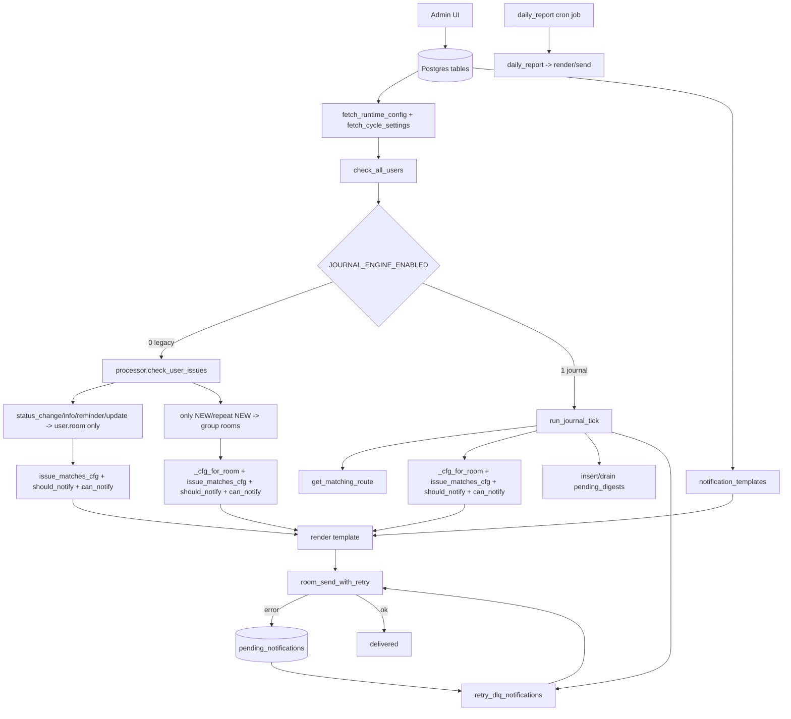

# Аудит связей уведомлений Via (доказательная версия)

Дата: 2026-04-21  
Объём: сквозной аудит `UI -> DB -> runtime -> check/filter -> route -> template -> send/DLQ`

## 1) Источники и baseline

- SQL baseline снят из runtime Postgres и сохранён в `docs/audit_baseline_2026-04-21.sql.md`.
- Runtime evidence взят из `data/bot.log`.
- Кодовые точки: `src/admin/routes/users.py`, `src/admin/routes/groups.py`, `src/database/load_config.py`, `src/bot/logic.py`, `src/preferences.py`, `src/bot/processor.py`, `src/bot/journal_tick.py`, `src/bot/journal_handlers.py`, `src/bot/scheduler.py`, `src/bot/main.py`.

Ключевые факты baseline:

- `JOURNAL_ENGINE_ENABLED=0` (активен legacy-контур внутри `check_all_users`).
- На момент SQL-среза: `bot_users=1`, `support_groups=2`, все route-таблицы (`status_room_routes`, `version_room_routes`, `user_version_routes`, `group_version_routes`) пустые.
- Очереди `pending_digests` и `pending_notifications` пустые.
- Формат `notify` смешанный: у пользователя и части групп это numeric status IDs, а не notification type keys.

Проверка консистентности snapshot-ов:

- `Pre-warm DM: ... 8 нужно резолвить` консистентен с runtime-срезом `Конфиг из БД обновлён, пользователей: 8` на `2026-04-21 08:21:34`.
- Текущий SQL baseline (`bot_users=1`) снят в более позднем состоянии БД; это подтверждается историей в том же `bot.log`: `пользователей: 58` -> `1` -> `0` -> `8` в разные моменты времени.
- Вывод: расхождение `8 vs 1` относится к разным временным точкам, а не к ошибке подсчёта prewarm.

## 2) Формальная карта атрибутов `UI -> DB -> runtime -> check`

| Attribute | UI source | DB | Runtime key | Check / apply |
|---|---|---|---|---|
| `room` | `users_create/users_update` (`/users`) | `bot_users.room` | `USERS[*].room` | `sender.resolve_room` (`@mxid -> !room`, `!room` напрямую) |
| `notify` (user) | `status_*` поля формы пользователя | `bot_users.notify` | `USERS[*].notify` | `logic.should_notify`, `logic.issue_matches_cfg` |
| `versions` (user) | `version_*` поля формы пользователя | `bot_users.versions` | `USERS[*].versions` | `logic.issue_matches_cfg` |
| `priorities` (user) | `priority_*` поля формы пользователя | `bot_users.priorities` | `USERS[*].priorities` | `logic.issue_matches_cfg` + `preferences.can_notify` (emergency bypass) |
| `group_id` | `users_create/users_update` | `bot_users.group_id` | `USERS[*].group_id` + `USERS[*].group_delivery` | `_cfg_for_room` подменяет фильтры при доставке в group room |
| `notify/versions/priorities` (group) | `groups_create/groups_update` (`/groups`) | `support_groups.notify/versions/priorities` | `GROUPS[*]` и `USERS[*].group_delivery` | `logic._cfg_for_room` -> `issue_matches_cfg/should_notify/can_notify` |
| `work_hours/work_days/dnd` | формы users/groups | `bot_users.*`, `support_groups.*` | `USERS[*]`, `USERS[*].group_delivery`, `GROUPS[*]` | `preferences.can_notify` |
| Status routes | `groups/.../status-routes/add` | `status_room_routes` | `ROUTING.status_routes` | `routing.get_matching_route` |
| Version routes (global/user/group) | UI routes add/delete | `version_room_routes`, `user_version_routes`, `group_version_routes` | `ROUTING.version_routes_global`, `USERS[*].version_routes` | `routing.get_matching_route` + `logic.issue_matches_cfg` |

## 3) Decision traces (7 контрольных потоков)

### 3.1 Статус `Информация предоставлена`

| step | function | inputs | decision | output | evidence |
|---|---|---|---|---|---|
| 1 | `scheduler.check_all_users` | `JOURNAL_ENGINE_ENABLED=0` | идти в legacy ветку | `processor.check_user_issues` | SQL baseline (`cycle_settings`) |
| 2 | `processor.check_user_issues` | status changed / journal update | в legacy для `status_change`, `info`, `reminder`, `issue_updated` target room = `user_cfg["room"]` | доставка идёт в personal DM room | код `src/bot/processor.py` (`send_safe(..., room, ...)`) |
| 3 | runtime | issue `#65313` | send `status_change`, затем `issue_updated` | 2 отправки в room `!EAAT...` | `2026-04-21 08:38:07` и `08:38:20` в `data/bot.log` |
| 4 | `logic.issue_matches_cfg` | user notify `["13","5","18"]` | status 13 матчится как filter | разрешение по статусу | SQL baseline (`bot_users.notify`) + `redmine_statuses` (`13=Информация предоставлена`) |

Вывод: кейс проходит как legacy-поток, но в логе нет отдельного события типа `info`; операторское ожидание "отдельного info-сообщения" не гарантируется при текущем runtime.

### 3.2 Group room (`!room`)

| step | function | inputs | decision | output | evidence |
|---|---|---|---|---|---|
| 1 | `load_config.user_orm_to_cfg` | user с `group_id=2` | добавить `group_delivery` в user cfg | готово к `_cfg_for_room` | код `src/database/load_config.py` |
| 2 | `processor.check_user_issues` | legacy path | group room используется только в ветке `notification_kind="new"` (и повторы `new`) | для `status_change/info/issue_updated` group room не target-ится | код `src/bot/processor.py` |
| 3 | `logic._cfg_for_room` | target room = group room | подменить фильтры на group значения | применяется только когда есть отправка в group room | код `src/bot/logic.py` + `src/bot/processor.py` |
| 4 | group filters | `support_groups.notify=["1","22"]` | статус `13` не входит в группу | для `Информация предоставлена` group-room send штатно не ожидается | SQL baseline + `redmine_statuses` (`1=Новая`, `22=Передано в работу.РВ`) |
| 5 | runtime | group room `!Xcxs...` есть в конфиге | отправок в эту room не найдено | no-send по кейсу | в `data/bot.log` есть `📣 Групповые комнаты из БД: !Xcxs...`, но нет `📨 -> !Xcxs...` |

Вывод: root cause для кейса `Информация предоставлена` в legacy — не пустые route-таблицы, а сам путь доставки (только personal room) плюс групповой фильтр `["1","22"]`, который не включает статус `13`.

### 3.3 Персональный DM (`@mxid -> !room`)

| step | function | inputs | decision | output | evidence |
|---|---|---|---|---|---|
| 1 | `sender.prewarm_dm_rooms` | 8 user MXID | resolve existing DM | 8 found | `2026-04-21 08:21:35` `Pre-warm DM... 8` |
| 2 | `sender._resolve_room_id` | `@dmitry...` | map to room id | `!EAATphs...` | `DM найден: @dmitry... -> !EAAT...` |
| 3 | send | issue `#65313` for user 1972 | send to resolved room | `📨 #65313 -> !EAAT...` | `2026-04-21 08:38:07` |

Вывод: DM-механизм работает и не проверяет/не валидирует групповые room.

### 3.4 Digest (накопление + drain)

| step | function | inputs | decision | output | evidence |
|---|---|---|---|---|---|
| 1 | `journal_handlers.handle_journal_entry` | `should_notify/can_notify == false` | `insert_digest` вместо send | row в `pending_digests` | код `src/bot/journal_handlers.py` |
| 2 | `digest_service.drain_pending_digests` | rows для user | render + send + delete rows | digest delivered | код `src/bot/digest_service.py` |
| 3 | runtime snapshot | queue state | пусто | no runtime sample | SQL baseline: `pending_digests=0` |

Статус трассы: **недостаточно данных для runtime-кейса** (в выбранном окне не было накопленных digest).

### 3.5 Reminder (цикл + лимит)

| step | function | inputs | decision | output | evidence |
|---|---|---|---|---|---|
| 1 | `processor.check_user_issues` | info/reminder decision | trigger `send_safe(..., "reminder")` | reminder send | код `src/bot/processor.py` |
| 2 | runtime | issue `#65338` | reminder отправлен в room `!DbF...` | `📨 ... (reminder)` | `2026-04-17 10:03:11` в `data/bot.log` |
| 3 | settings | legacy: `REMINDER_AFTER` / journal: `DEFAULT_REMINDER_INTERVAL` | ключи различаются по контурам | корректно для dual-engine | `src/bot/processor.py`, `src/bot/reminder_service.py`, SQL baseline |

### 3.6 Daily report (scheduler path)

| step | function | inputs | decision | output | evidence |
|---|---|---|---|---|---|
| 1 | `main` | `CATALOGS.cycle_settings.get("DAILY_REPORT_ENABLED", "1")` | при отсутствии ключа в БД используется дефолт `"1"` | daily_report включён | код `src/bot/main.py` + SQL baseline (`ключ отсутствует`) |
| 2 | `scheduler.daily_report` | user 1972 | report rendered and sent | `📊 Отчёт user 1972: 32 задач` | `2026-04-21 09:00:11` |
| 3 | runtime | hourly trigger | fired at 09:00 | `📊 Утренний отчёт...` | `2026-04-21 09:00:00` |

### 3.7 DLQ retry (passive)

| step | function | inputs | decision | output | evidence |
|---|---|---|---|---|---|
| 1 | `journal_tick` | after reminder phase | call `retry_dlq_notifications` | retry only in journal contour | код `src/bot/journal_tick.py` |
| 2 | `scheduler.retry_dlq_notifications` | due DLQ rows | send/mark/fail | lifecycle exists in коде | код `src/bot/scheduler.py` |
| 3 | runtime | `JOURNAL_ENGINE_ENABLED=0` and `pending_notifications=0` | retry не наблюдается | no passive event | SQL baseline + отсутствие `DLQ retry` в `data/bot.log` |

Статус трассы: **недостаточно данных для runtime-кейса**, но выявлено архитектурное условие: при `JOURNAL_ENGINE_ENABLED=0` DLQ retry не запускается.

## 4) Проверка гипотез

- **Гипотеза A: дублирование логов из-за двойного handler** — **подтверждена**.  
  Evidence: в `data/bot.log` одинаковые пары строк с тем же timestamp и message (`#65338`, `#65313`, `Планировщик...`). В `src/bot/main.py` логгеру без guard добавляются file handler и stream handler (`logger.addHandler(...)`).

- **Гипотеза B: активный контур journal** — **опровергнута** для текущего baseline.  
  Evidence: `JOURNAL_ENGINE_ENABLED=0` в SQL; в логах есть legacy-паттерн `👤 User ...` и нет `✅ Журнальный цикл завершён`.

- **Гипотеза C: `_cfg_for_room` не влияет на group-room фильтры** — **опровергнута**.  
  Evidence: `_cfg_for_room` явно подменяет `notify/versions/priorities/work_hours/work_days/dnd` для group room перед `issue_matches_cfg/should_notify/can_notify`.

## 5) Архитектурная блок-схема (фактическая)

## 6) Дефект-лист (`symptom -> root cause -> evidence -> fix`)

### P1. `Информация предоставлена` воспринимается как "не отправлено"

- symptom: оператор ожидает отдельное `info`-уведомление, видит только `status_change/issue_updated`.
- root cause: смешение semantic-ожиданий и фактического event mapping legacy/logging.
- evidence: `#65313` в `data/bot.log` (есть send), `bot_users.notify` хранит status IDs, а не type keys.
- fix: разделить `status_filters` и `notification_types` в модели/форме, добавить explicit reason log (`why sent/why skipped`).

### P1. Group room не получает событий при наличии комнаты в БД

- symptom: группа заведена (`!room`), но в room нет уведомлений.
- root cause: в legacy `status_change/info/reminder/issue_updated` отправляются в `user.room`; group room участвует только в ветках `new/repeat new`, а group filter `["1","22"]` дополнительно исключает статус `13`.
- evidence: `src/bot/processor.py` (ветвление send targets), SQL baseline (`support_groups.notify=["1","22"]`), `redmine_statuses` (13 != 1/22), отсутствие `📨 -> !Xcxs...` в `data/bot.log`.
- fix: добавить в UI "route simulator" с явным объяснением целевых room для каждого типа события и статуса; при ожидании групповых статусов вне NEW — отдельный путь/настройка.

### P2. Потенциально опасный override-шаблон `tpl_new_issue` (оба body пустые)

- symptom: в `notification_templates` есть `tpl_new_issue` с пустыми `body_html/body_plain`.
- root cause: запись-override существует, но контент не заполнен.
- evidence: SQL baseline (`has_body_html=false`, `has_body_plain=false`), `src/bot/template_loader.py` (`if src: ... else: env.get_template(...)`).
- fix: это **не ломает отправку сейчас** (работает fallback на файловый `templates/bot/tpl_new_issue.html.j2`), но нужно валидацией UI запретить "пустой override", чтобы убрать двусмысленность.

### P2. Дублирование логов

- symptom: почти каждая строка в `bot.log` повторяется.
- root cause: повторное навешивание handlers на `redmine_bot` без идемпотентной проверки.
- evidence: повторяющиеся пары в `data/bot.log`; `logger.addHandler` без guard в `src/bot/main.py`.
- fix: добавить guard (`if not logger.handlers` / фильтр по типу+target) и `logger.propagate = False`.
- monitoring note: если внешние алерты завязаны на частоту/уровень `journal_contract_check`, после шумоподавления нужно синхронно обновить пороги/паттерны, иначе возможны ложные «green» состояния.

### P2. DLQ retry не работает в legacy-режиме

- symptom: при `JOURNAL_ENGINE_ENABLED=0` нет пассивного retry DLQ.
- root cause: вызов `retry_dlq_notifications` находится в `journal_tick`, который не запускается при legacy.
- evidence: код `src/bot/journal_tick.py`, SQL baseline (`JOURNAL_ENGINE_ENABLED=0`, `pending_notifications=0`).
- fix: вынести periodic DLQ retry в отдельную scheduler job, независимую от engine.

### P3. `UNASSIGNED` с пустым `room_id`

- symptom: `support_groups` содержит `UNASSIGNED` с пустым `room_id` (в baseline попадает в `room_kind=other`).
- root cause: системная reserved-группа (`GROUP_UNASSIGNED_NAME`), исключается из assignable списков и не предназначена как delivery room.
- evidence: `src/admin/helpers_ext.py` (`_group_excluded_from_assignable_lists`, `_is_reserved_support_group`), SQL baseline (`id=1`, `name=UNASSIGNED`, `room_id=''`).
- fix: by design; добавить явную пометку в UI/документации "служебная группа без доставки", чтобы не трактовать как рабочий routing target.

## 7) Вердикт и статус завершения

- SQL baseline получен: **да**.
- Формальная карта `UI->DB->runtime->check`: **да**.
- 7 контрольных traces: **да** (для digest/DLQ runtime case отмечен `недостаточно данных`, но кодовой и SQL evidence приложен).
- Блок-схема архитектуры обновлена и отделена от процесса аудита: **да**.
- Гипотезы имеют финальный статус (`подтверждена/опровергнута/недостаточно данных`): **да**.
- Консистентность код/данные/отчёт проверена: **да**, выявлены 5 дефектов/наблюдений P1/P2/P3.
