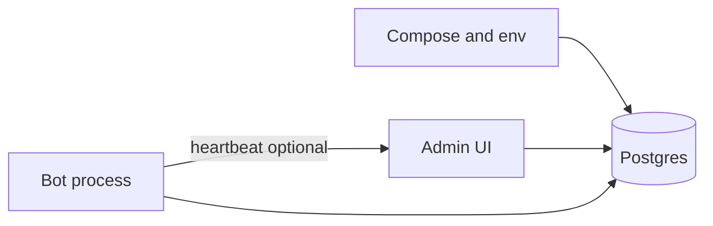
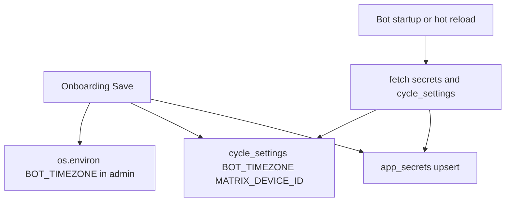

# Расширенный day zero: что происходит при настройке Via

Документ для оператора: связь между **экраном админки**, **таблицами Postgres** и **процессом бота**. Краткая модель ролей: [ARCHITECTURE_ADMIN_DB_BOT.md](ARCHITECTURE_ADMIN_DB_BOT.md). Матрица экран → таблица: [ADMIN_DB_BOT_AUDIT.md](ADMIN_DB_BOT_AUDIT.md).

---

## 1. До первого входа (инфраструктура)

| Шаг | Что делаете | Что происходит технически |
|-----|-------------|---------------------------|
| Запуск compose | Поднимаются контейнеры БД, админки, бота (если включены) | PostgreSQL слушает порт; переменная `DATABASE_URL` в `.env` должна совпадать с учётными данными тома БД |
| Миграции | `alembic upgrade head` (в CI при деплое — автоматически) | Создаются/обновляются таблицы: `bot_users`, `app_secrets`, `cycle_settings`, `bot_app_users`, и т.д. |
| Секрет шифрования | `APP_MASTER_KEY` в `.env` | Нужен для чтения/записи `app_secrets` (ключи Redmine/Matrix в зашифрованном виде) |

Бот и админка — разные процессы. **Админка** всегда ходит в БД. **Бот** при старте загружает конфиг из БД (и при необходимости ждёт секреты), затем может **подгружать изменения без рестарта** ([`config_hot_reload.py`](../src/bot/config_hot_reload.py)), если не выключено переменными окружения.

---

## 2. Первый администратор: `/setup` и `/login`

**`/setup` (POST)** доступен, пока в БД нет ни одного администратора панели.

- В таблицу **`bot_app_users`** добавляется запись с ролью admin и хешом пароля.
- Дальше вход только через **`/login`**: проверка пароля; при успехе создаётся запись в **`bot_sessions`** (cookie сессии).

Это **не** пользователи Redmine и не `bot_users`: это учётки **веб-панели**.

---

## 3. Настройки сервиса: `/onboarding`

### 3.1. «Проверить доступ» (`POST /onboarding/check`)

- Берёт введённые (или уже сохранённые в форме) параметры Redmine и Matrix.
- Делает тестовые HTTP-запросы: к API Redmine и к Matrix (homeserver).
- **Не обязательно** пишет всё в БД сам по себе — цель: показать, что URL и ключи рабочие до окончательного сохранения.

### 3.2. «Сохранить» (`POST /onboarding/save`)

Последовательность по смыслу:

1. **Секреты интеграции** (`REDMINE_URL`, `REDMINE_API_KEY`, `MATRIX_*`) — для каждого непустого поля без маски «••••» выполняется upsert в **`app_secrets`** (шифрование через `APP_MASTER_KEY`).
2. **Сервисная таймзона** и **`BOT_TIMEZONE`** — запись в **`cycle_settings`** и дублирование в секрет `__service_timezone` где применимо (см. код [`settings.onboarding_save`](../src/admin/routes/settings.py)).
3. **`MATRIX_DEVICE_ID`** — ключ в **`cycle_settings`**.
4. **`os.environ["BOT_TIMEZONE"]`** в процессе админки обновляется, чтобы UI и логика сразу видели выбранную зону.

**Бот** при следующем цикле загрузки/ hot reload подхватит `cycle_settings` и секреты из БД. Если только что **впервые** появились ключи Matrix/Redmine, часто нужен **`docker compose restart bot`** — см. [ADMINISTRATOR_GUIDE.md](ADMINISTRATOR_GUIDE.md) (рестарт vs hot reload).

### 3.3. Каталог в onboarding (`POST /onboarding/catalog/save`)

- Сохраняет JSON справочника версий (legacy-путь) в **`app_secrets`** под именем типа `__catalog_versions` (зашифрованное blob-поле), если форма использует этот путь.

---

## 4. Пользователи бота: `/users`

| Действие | HTTP | Таблицы / эффект |
|----------|------|------------------|
| Список / создание / редактирование | GET/POST | **`bot_users`**: `redmine_id`, `room` (MXID `@…` или полный `!room:server`), JSONB `notify` / `versions` / `priorities`, часовой пояс, DND и т.д. |
| Доп. маршрут по версии | POST `.../version-routes/add` | **`user_version_routes`**: версия Redmine → `room_id` для этого пользователя |
| Удаление маршрута версии | POST `.../version-routes/{id}/delete` | DELETE строки в **`user_version_routes`** |
| Удаление пользователя | POST `.../delete`, bulk-delete | DELETE **`bot_users`**; FK удаляет **`user_version_routes`**; дополнительно вызывается очистка **`bot_issue_state`**, **`pending_notifications`**, **`bot_user_leases`** по `user_redmine_id` ([`user_runtime_cleanup`](../src/database/user_runtime_cleanup.py)) |
| Тестовое сообщение | POST `/users/test-message` | Отправка через Matrix API из админки (проверка комнаты), не создаёт строку в DLQ как «недоставленное уведомление бота» в том же смысле, что фоновая очередь |

После сохранения пользователя бот подхватит изменения при **hot reload** или со следующего полного цикла загрузки конфига.

---

## 5. Группы: `/groups`

| Действие | Таблицы |
|----------|---------|
| Создание / правка группы | **`support_groups`**: комната группы, фильтры `notify` / `versions` / `priorities` в JSONB |
| Маршруты статусов/версий из карточки группы | **`group_version_routes`**, строки в **`status_room_routes`** — только формы `/groups/{id}/status-routes/*` ([`groups.py`](../src/admin/routes/groups.py)) |
| Удаление группы | DELETE **`support_groups`**; у пользователей `group_id` → NULL; каскад по маршрутам группы |

---

## 6. Глобальные маршруты версий и статусов

- [`routes_mgmt`](../src/admin/routes/routes_mgmt.py): формы **`version_room_routes`** (глобальная карта «версия Redmine → комната Matrix») на **`/settings/routes/version`** (старый `GET /routes/version` → 301); **`status_room_routes`** настраиваются только из карточки группы.
- `GET /routes/status` остаётся редиректом на `/groups` для старых закладок (без POST).

---

## 7. Каталог Redmine: API `/api/catalog/*`

- **Список / toggle / delete** — таблицы **`redmine_statuses`**, **`redmine_versions`**, **`redmine_priorities`**.
- **Синхронизация с Redmine** (`POST /api/catalog/sync-all`) — HTTP к API Redmine с ключом из **`app_secrets`**; upsert строк, «скрытие» не найденных на стороне Redmine.

Бот при работе использует эти справочники через **`load_catalogs`** ([`catalogs.py`](../src/bot/catalogs.py)).

---

## 8. Секреты: `/secrets`

- **Сохранить** — upsert **`app_secrets`**.
- **Удалить** — POST **`/secrets/delete`**, строка удаляется из БД; бот перестаёт видеть ключ после следующей загрузки; восстановите значение формой или через `.env` для критичных переменных.

---

## 9. Контент цикла бота: API `/api/bot/content`

GET/POST — только **расписание утреннего отчёта** (`DAILY_REPORT_ENABLED`, `DAILY_REPORT_HOUR`, `DAILY_REPORT_MINUTE`) в **`cycle_settings`**. Тексты Matrix и утреннего отчёта — через **`/api/bot/notification-templates`** и таблицу **`notification_templates`** (`tpl_*`). Бот читает `cycle_settings` в **`main`** / hot reload.

---

## 10. Дашборд и операции бота: `POST /ops/bot/{action}`

- Команды **start/stop/restart** идут в Docker (если настроено). Это **инфраструктура**, не строка в `bot_users`.
- В журнал событий и при необходимости в **`bot_ops_audit`** пишется факт операции.

---

## 11. События: `/events`

- Данные **не** из SQL: читается **файл лога** на сервере (см. [`events.py`](../src/admin/routes/events.py)). Поэтому «удаление пользователя» из БД не чистит этот журнал — он про жизнь процессов.

---

## 12. Heartbeat и очередь команд

- **`POST /api/bot/heartbeat`** — бот периодически сообщает «жив», запись в **`bot_heartbeat`**.
- **`GET /api/bot/commands`** (если используется тонкий воркер) — выдача отложенных доставок из **`pending_notifications`** и связанная семантика DLQ.

---

## 13. Когда нужен рестарт бота

Сводка (детали — в [ADMINISTRATOR_GUIDE.md](ADMINISTRATOR_GUIDE.md)):

- **Часто достаточно hot reload** для изменений в `bot_users`, группах, маршрутах, `cycle_settings`, справочниках.
- **Рестарт процесса** типично после смены критичных секретов в БД **впервые** или при смене частей `.env` (логи, `ADMIN_URL`, и т.д.), либо при проблемах с Matrix `device_id` после смены.

---

## 14. Идеи на будущее (не обязательный функционал)

- **Счётчики** `bot_issue_state` / `pending_notifications` / `bot_user_leases` по Redmine ID пользователя в UI поддержки — упростят диагностику без SQL (сейчас достаточно прямых запросов к БД при необходимости).
